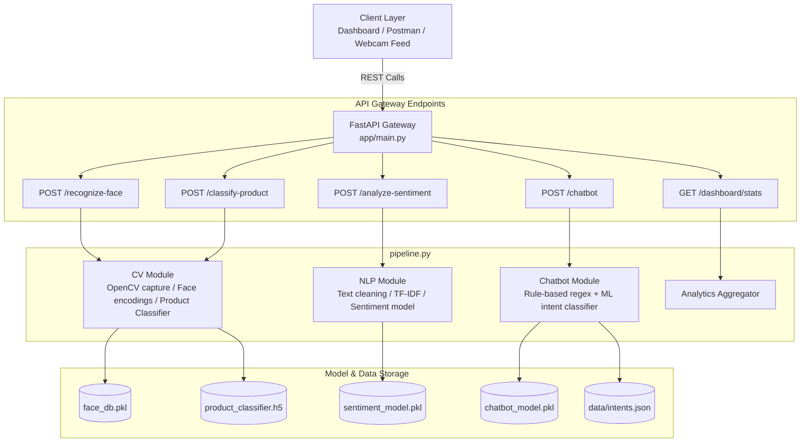

# 🛍️ AI-Powered Smart Retail & Customer Intelligence Platform

An end-to-end, production-grade artificial intelligence platform built for modern physical retail stores and e-commerce businesses. The system recognizes returning loyalty customers via face recognition, classifies product images across 5 categories, performs real-time customer review sentiment analysis, answers FAQs via a hybrid rule/ML chatbot, and exposes everything through a production FastAPI Gateway and interactive Streamlit Dashboard.

---

## 📌 Syllabus-to-Module Mapping Table

| Syllabus Topic | Project Module | Implementation File |
| :--- | :--- | :--- |
| **OpenCV Basics** | Image preprocessing, Canny edge detection, Haar cascades | `cv_utils.py` |
| **Image Classification** | Product category classifier (shoes, bags, electronics, clothing, groceries) | `app/services/cv_service.py`, `product_classifier.h5` |
| **Face Recognition** | Customer recognition & visit logging pipeline | `face_recognition_module.py`, `face_db.pkl` |
| **Text Preprocessing** | Text cleaning, tokenization, stopword removal, lowercasing | `app/services/nlp_service.py` |
| **Sentiment Analysis** | Customer review/feedback sentiment classifier (TF-IDF + LogisticRegression) | `app/models/sentiment_model.pkl` |
| **Chatbot Basics** | FAQ/support hybrid chatbot (rule-based regex + ML classifier) | `app/services/chatbot_service.py`, `intents.json` |
| **ML Pipelines** | Unified pipeline loading all models once at startup | `pipeline.py` |
| **Pickle / Joblib** | Model serialization & database persistence | `train_all_models.py`, `.pkl` / `.h5` |
| **FastAPI REST API** | REST API gateway serving all model endpoints | `app/main.py`, `app/routers/` |
| **API Deployment** | Dockerized deployment & CI/CD workflow | `Dockerfile`, `.github/workflows/deploy.yml` |

---

## 🏗️ System Architecture



---

## 📂 Project Directory Structure

```
smart-retail-ai/
├── app/
│   ├── main.py                       # FastAPI entrypoint, security header & middleware
│   ├── schemas.py                    # Pydantic request/response schemas
│   ├── routers/
│   │   ├── vision.py                 # POST /recognize-face, POST /classify-product
│   │   ├── nlp.py                    # POST /analyze-sentiment
│   │   └── chatbot.py                # POST /chatbot, GET /dashboard/stats
│   ├── models/
│   │   ├── product_classifier.h5     # Serialized product classifier model
│   │   ├── face_db.pkl               # Serialized face encodings & customer DB
│   │   ├── sentiment_model.pkl       # Serialized TF-IDF + Sentiment pipeline
│   │   └── chatbot_model.pkl         # Serialized TF-IDF + Intent classifier pipeline
│   └── services/
│       ├── cv_service.py             # Computer Vision service layer
│       ├── nlp_service.py            # Text preprocessing & sentiment service
│       └── chatbot_service.py        # Hybrid rule + ML chatbot service
├── cv_utils.py                       # Standalone OpenCV utilities (Canny, Haar cascades, resize)
├── face_recognition_module.py        # Face detection, encodings & timestamped visit logger
├── pipeline.py                       # Unified ML Pipeline loading models once at startup
├── dashboard.py                      # Interactive Streamlit analytics dashboard
├── notebooks/
│   ├── 01_image_classifier_training.ipynb
│   ├── 02_face_recognition_setup.ipynb
│   └── 03_sentiment_model_training.ipynb
├── data/
│   ├── reviews.csv                   # Retail review sentiment dataset
│   └── intents.json                  # Custom FAQ intents (25+ retail customer intents)
├── tests/
│   └── test_endpoints.py             # Pytest suite for all REST endpoints & services
├── Dockerfile                        # Multi-stage production Docker container definition
├── requirements.txt                  # Python dependencies
├── train_all_models.py               # Model training & serialization script
├── README.md                         # Project documentation & ethics report
└── .github/workflows/deploy.yml      # GitHub Actions CI/CD workflow
```

---

## 🚀 Quick Start & Installation

### ⚡ 1-Click Launch (Recommended for Windows)
Simply double-click **[`START_PLATFORM.cmd`](file:///C:/Users/yasha/.gemini/antigravity/scratch/smart-retail-ai/START_PLATFORM.cmd)** inside the project folder!
- It automatically launches both FastAPI (Port 8000) and Streamlit Dashboard (Port 8501) in separate windows.
- It opens your web browser tabs automatically.
- To stop everything with 1-click, double-click **[`STOP_PLATFORM.cmd`](file:///C:/Users/yasha/.gemini/antigravity/scratch/smart-retail-ai/STOP_PLATFORM.cmd)**.

---

### Manual Launch Steps
```bash
git clone https://github.com/your-org/smart-retail-ai.git
cd smart-retail-ai

# Create virtual environment
python -m venv venv
source venv/bin/activate  # On Windows: venv\Scripts\activate

# Install dependencies
pip install -r requirements.txt
```

### 2. Train & Serialize All Models
```bash
python train_all_models.py
```

### 3. Run FastAPI Backend Server
```bash
uvicorn app.main:app --reload --port 8000
```
- Interactive Swagger API Docs: `http://localhost:8000/docs`
- ReDoc API Documentation: `http://localhost:8000/redoc`

### 4. Run Streamlit Interactive Dashboard
```bash
streamlit run dashboard.py
```
Access dashboard in your browser at `http://localhost:8501`.

### 5. Run Automated Test Suite
```bash
pytest tests/test_endpoints.py -v
```

---

## 🐳 Docker Deployment

### Build & Run Container
```bash
# Build Docker image
docker build -t smart-retail-ai:latest .

# Run Docker container
docker run -d -p 8000:8000 --name retail-app smart-retail-ai:latest
```

---

## 📡 API Endpoints Overview

| Method | Endpoint | Description | Sample Payload / Input |
| :--- | :--- | :--- | :--- |
| `POST` | `/recognize-face` | Recognizes returning customer from image & logs visit | `multipart/form-data` image file |
| `POST` | `/classify-product` | Classifies product image into 5 retail categories | `multipart/form-data` image file |
| `POST` | `/analyze-sentiment` | Classifies customer review sentiment | `{"text": "Love this handbag!"}` |
| `POST` | `/chatbot` | Returns hybrid automated chatbot reply | `{"message": "What is return policy?"}` |
| `GET` | `/dashboard/stats` | Returns aggregate visit & sentiment statistics | `None` |

---

## 📜 Ethics, Data Privacy & Bias Report: Facial Recognition in Retail

> [!IMPORTANT]
> Facial recognition technology in retail stores offers significant convenience and personalization for loyalty members, but requires strict adherence to legal and ethical frameworks.

### 1. User Consent & Opt-In Framework
- **Explicit Informed Consent:** Facial recognition MUST operate strictly on an opt-in basis for consenting loyalty program members. Customers must actively register via the mobile app or store kiosk after reviewing clear terms.
- **Right to Erasure (GDPR/CCPA):** Customers must have an immediate mechanism to delete their facial template vector from `face_db.pkl` at any time.

### 2. Biometric Data Security & Encryption
- **No Raw Image Storage:** Store ONLY non-reversible 128D mathematical feature encodings vector representations, never raw facial photographic images.
- **Encryption at Rest & in Transit:** Facial database files must be encrypted with AES-256 encryption and accessible only by secure local store gateway nodes.

### 3. Algorithmic Bias & Fairness Mitigation
- **Demographic Parity Audits:** Facial recognition models must be regularly evaluated across diverse age groups, skin tones, and gender identities using benchmark datasets (e.g., FairFace) to maintain equal recognition accuracy and prevent disproportionate false rejection rates.
- **Human-in-the-Loop Safeguards:** Automated facial identification must never trigger automatic security interventions without human verification by trained retail personnel.
